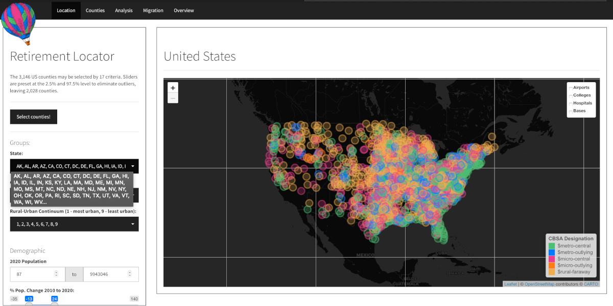

<!-- README.md is generated from README.Rmd. Please edit that file -->

```{r, include = FALSE}
knitr::opts_chunk$set(
  collapse = TRUE,
  comment = "#>",
  fig.path = "man/figures/README-",
  out.width = "100%"
)
```

# retirementDash

<!-- badges: start -->
[](https://lifecycle.r-lib.org/articles/stages.html#experimental)
[](https://github.com/RobWiederstein/retirementDash/actions)
<!-- badges: end -->

<h4 align="center">
<a href="https://rob-wiederstein.shinyapps.io/retirement-dashboard/?_ga=2.138388592.1542637753.1630614255-2110524801.1630416115"><br/></a>
<a href="https://rob-wiederstein.shinyapps.io/retirementdash/?_ga=2.99037854.1258475930.1633524763-1285109657.1633184174">Retirement
Locator Dashboard</a>
</h4>

The goal of `retirementDash` is to present pertinent and relevant criteria for selecting a retirement location in the United States.  This project proceeded in two stages.  The first stage was to create a county-level dataset `retirementData`, which is hosted in its own package and [repository](https://github.com/RobWiederstein/retirementData).  The second stage was to display the data in an interactive, user-friendly dashboard, shown above.

## Installation

You can install the development and experimental version of `retirementDash` from its [repository](https://github.com/RobWiederstein/retirementDash) with:

``` r
# Or the development version from GitHub:
# install.packages("devtools")
install_github("RobWiederstein/retirementDash")
```

## Usage

### Step 1 Landing Page

The side panel provides 17 criteria to filter the 3,142 United States counties.  The sliders were preset to the 2.5% and the 97.5% percentiles to eliminate outliers.  With seventeen sliders set in a similar manner, only 2028 counties display when the `select counties` button is pushed.

The map contains an overlay for airports, colleges, hospitals and military bases.  For those features to be displayed, the adjacent box must be checked.

### Step 2 Counties Tab

The counties tab displays the filtered results in a tabular form.  The user may select, sort and download the counties that meet his or her criteria.

### Step 3 Analysis Tab

The user may use the `x-axis` and `y-axis` axis to create a scatterplot.  Additional attributes for size and color are provided.  This could be helpful in further refining the criteria on the landing page.  For example, some parts of the United States have very high housing prices relative to household income, a variable named `years_to_payoff`.  Users may then reset the inputs based upon the analyzer plot.

### Step 4 Migration Tab

A fourth tab includes inter-county migration data from the IRS.  Entry of one county shows where its residents migrated to ("moved-out") and where its residents came from ("moved-in").

## Acknowledgements

The following packages were indispensable to the both the `retirementData` and `retirementDash`projects:

- [`shiny`](https://github.com/rstudio/shiny)

- [`golem`](https://github.com/ThinkR-open/golem)

- [`pkgdown`](https://github.com/r-lib/pkgdown)

- [`usethis`](https://github.com/r-lib/usethis)

- [`styler`](https://github.com/r-lib/styler)

- [`leaflet`](https://github.com/Leaflet/Leaflet)

- [`plotly`](https://github.com/plotly/plotly.R)

- [`DT`](https://github.com/rstudio/DT)

## Code of Conduct

Please note that the retirementDash project is released with a [Contributor Code of Conduct](https://contributor-covenant.org/version/2/0/CODE_OF_CONDUCT.html). By contributing to this project, you agree to abide by its terms.
